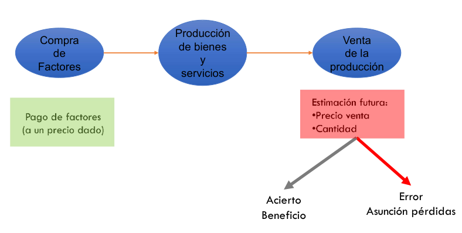
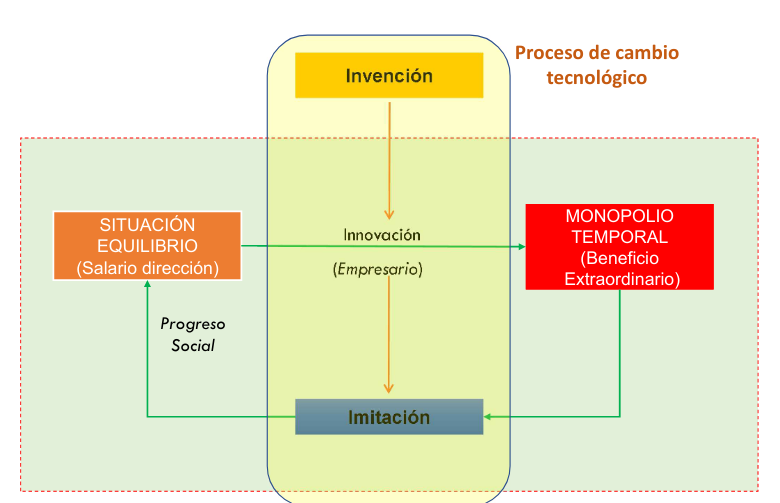
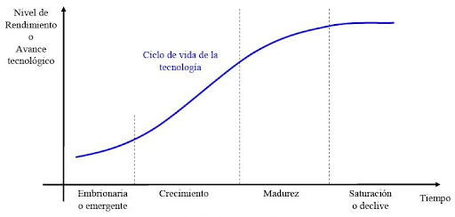
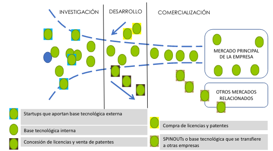

# La organización y la empresa

## Definiciones

Una **organización** es una unidad coordinada formada por un mínimo de dos
personas que trabajan para alcanzar un objetivo o conjunto de objetivos 
comunes.

Una **empresa** es una organización que transforma un conjunto de recursos 
físicos, monetarios y cognitivos en bienes y/o servicios, con el objetivo 
principal de obtener beneficios. ¿Es la maximización del beneficio la única
finalidad de una empresa?

 - **Sí** *(Friedman)*: Maximizar el beneficio siempre y cuando se respeten 
las leyes, las normas de economía capitalista y evitando los engaños y fraudes.
 - **No** *(Freeman)*: Las empresas tienen que buscar satisfacer no sólo a los
propietarios de las empresa si no al resto de sus stakeholders.

## Clasificación de una empresa

### Dependiendo de su forma jurídica

 1. Empresario individual.
 2. Formas societarias (sociedad anónima, sociedad colectiva, sociedad de
responsabilidad limitada, ...).

### Dependiendo de su tamaño

| **Categoría** | **Nº trabajadores** | **Volumen de negocios** | **Balance anual** |
|:---:|:---:|:---:|:---:|
| _Microempresa_ | <10 | <2M€ | <2M€ |
| _Pequeña_ | <50 | <10M€ | <10M€ |
| _Mediana_ | <250 | <50M€ | <43M€ |
| _Grande_ | >250 | >50M€ | >43M€ |

## Enfoque sistémico

Un **sistema** es un conjunto de elementos relacionados dinámicamente que 
realizan una actividad para alcanzar un objetivo y operar con entradas 
(información, energía, materia) y proveer salidas (información, energía o 
materia) procesadas.

La **retroalimentación *(feedback)*** es un mecanismo o sistema de control que
permite a un sistema conocer si se producen desviaciones en los límites
fijados.

La **homeostasis** es un equilibrio interno obtenido tras la autorregulación,
que permite al sistema mantener algunas variables dentro de los límites
deseados.

Una empresa se puede considerar un sistema puesto que transforma materias
primas en productos materiales, ahorro en capital y procesa información. Es un
**sistema abierto** pues está en constante interacción con su entorno.

Es también un **sistema autorregulable**, pues si se devía de sus objetivos, el
proceso de retroalimentación intentará mantener el equilibrio.

### Susbsistemas funcionales de la empresa

El principio de jerarquía de los sistemas permite descomponer el sistema en
subsistemas, que conservan las propiedades del sistema del que derivan. Estos
susbsitemas interactúan para obtener **sinergias**, logrando ser más
productivos que si funcionaran de forma independiente.

El **criterio funcional** divide una empresa en tantos subsistemas como
actividades desarrolle.

 - *Subsistema de aprovisionamiento*: Se encarga de adquirir los insumos o 
factores necesarios para el proceso productivo.
 - *Subsistema de producción*: Transforma los inputs en productos o servicios 
para satisfacer las necesidades del mercado.
 - *Subsistema de comercialización*: Toma las decisiones sobre el producto, 
precio, promoción y distribución, además de la investigación de mercados.
 - *Subsistema de recursos humanos*: Se encarga de la administración de los 
recursos humanos (reclutamiento, selección, orientación, ...).
 - *Subsistema financiero*: Determina la cuantía de fondos necesarios para la
organización, los suministra y aplica a las inversiones más convenientes.
 - *Subsistema de dirección*: Administra la empresa en sus niveles estratégicos
y de gestión. Relaciona a la empresa con el entorno. Planifica, organiza y
controla el resto de subsistemas.

## Dirección de empresas

La **eficacia** mide el nivel de cumplimento que ha logrado una organización 
respecto a sus objetivos.

La **eficiencia** mide si una organización está utilizando la cantidad adecuada de 
recursos para lograr sus objetivos.

### Empresario, capitalista, directivo

#### Empresario

Características:

 - Descubre y explota oportunidades.
 - Inicia y motiva el proceso de cambio (creador).

Comportamiento:

 - Acepta el riesgo.
 - Usa la intuición y exploración. Está alerta.
 - Utiliza el liderazgo y ruptura en los modos de actuación.
 - Identifica oportunidades de negocio.
 - Es el responsable de la creación de empresas.

#### Capitalista

Características:

 - Es el propietario del capital (accionista).
 - Es un accionista de control y/o pasivo.

Comportamiento:

 - Presenta aversión al riesgo.
 - Evalúa alternativas.
 - Es el responsable de la elección de activos de riesgo.

#### Directivo

Características:

 - Administra y gestiona recursos (administrador).

Comportamiento:

 - Presenta aversión al riesgo.
 - Es un decisor "racional".
 - Es el responsable de crear y mantener ventaja competitiva, además de
crear confianza para la cooperación.
 - Es también el responsable de la supervisión del proceso administrativo.

#### Teoría del empresario riesgo de Knight

El beneficio empresarial se justifica por los riesgos (técnicos y económicos) 
que asume el empresario al desarrollar su actividad.

{ width=60% }

#### Teoría del empresario emprendedor de Schumpeter

{ width=60% }

### *Stakeholders*

Los *stakeholders* de la empresa son los grupos y personas que la afectan o que
son afectadas por ésta junto con los intereses, demandas y expectativas que 
están en juego en cada caso, y el poder real que tiene cada uno en esta red de 
relaciones.

### La tecnoestructura de Galbraith

Se define **tecnoestructura** como órgano colegiado que se encarga de dirigir 
la empresa. Está compuesto por profesionales provenientes de diversos campos 
del conocimiento. 

Se ve al empresario como órgano colectivo de toma de decisiones en 
contraposición a la visión clásica de persona física.

Esta estructura se justifica por la separación entre la propiedad y el control
(administración) de las empresas a medida que éstas aumentan de tamaño.

### Estructura de propiedad de una empresa

La RAE define propiedad como "el derecho o facultad de poseer alguien algo y 
poder disponer de ello dentro de los límites legales". La estructura de
propiedad se relaciona con el modo en que se distribuye el capital de las 
empresas entre sus propietarios legales (accionistas). Podemos distinguir dos 
categorías de accionistas: los de control y los pasivos o inversores 
financieros.

En el sector privado, se distinguen tres grupos de propiedad: familias, 
entidades financieras (capital bancario) y empresas industriales y de servicios
(capital empresarial).

### Dirección y gobierno

La propiedad de una empresa conlleva unos ciertos derechos y obligaciones tanto
económicas como jurídicas. Es útil distinguir entre las figuras del empresario,
propietario y directivo. En el caso de las pequeñas empresas, estas figuras
suelen coincidir.

Se definen los siguientes niveles de dirección:

 1. *Alta dirección*: Ocupan el estrato superior de la jerarquía. Fijan los 
grandes objetivos y controlan que los mismos se cumplen.
 2. *Dirección intermedia*: Son el enlace jerárquico para la transmisión de 
instrucciones desde la alta dirección. Adoptan las decisiones propias de su 
nivel (financieras, de personal, logísticas, ....).
 3. *Base operativa*: Es la escala básica, formada por los empleados, que se
dividen en distintas categorías y centros operativos.
 4. *Tecnoestructura*: Formada por analistas, especialistas, expertos, personal
de apoyo...

### Gobierno corporativo

Es la definición y concreción de las relaciones entre la administración de las
empresas, los accionistas, los directivos y demás partes interesadas. Con ello 
se pretende dotar a las empresas de una estructura que controle todas sus
operaciones, e impiedir o limitar los conflictos que surgen entre las distintas
partes. El principal mecanismo de dicho control serían los códigos de buen
gobierno.

#### Mecanismos de control legal

 1. *Junta general*: La Junta de accionistas junto a los administradores se
encargan de manifestar, ejecutar y cumplir la voluntad colectiva de la 
sociedad. No puede administrar ni representar a la sociedad, pero sí nombrar a
los administradores.
 2. *Órganos de administración*: Son los que ejercen la gestión y 
representación de las sociedades. Son órganos necesarios y permanentes. Pueden 
ser unitarios o conjuntos y se eligen por los accionistas.

#### Modelos de gobierno corporativo

 - *Anglosajón*: Se caracteriza por un accionariado muy disperso. Las empresas
suelen ser más independientes, al no estar controladas por grupos reducidos de 
accionistas.
 - *Alemán*: Su concentración accionarial es muy importante. Son controladas
por grupos de inversores estables. Los accionistas minoritarios están poco 
protegidos.
 - *Japonés*: Es un sistema monista, que está dominado por directivos con 
importantes participaciones accionariales cruzadas entre empresas. El 
Presidente suele ser el primer ejecutivo, con poderes para representar a la 
compañía.

## Responsabilidad social corporativa en las empresas *(RSC)*

El concepto de responsabilidad social de la empresa se origina en los años 50, 
ligado al rápido incremento del tamaño y poder de las empresas americanas,
junto con el surgimiento de problemas sociales urgentes en los años 60 y 70.

La **RSC** se define como el conjunto de obligaciones y compromisos, legales y
éticos, nacionales e internacionales, con los grupos de interés, que se derivan
de los impactos que la actividad y operaciones de las organizaciones producen 
en el ámbito social, laboral, medioambiental y de los derechos humanos. La RSC 
afecta a la propia gestión de las organizaciones, tanto en sus actividades 
productivas y comerciales, como en sus relaciones con los grupos de interés.

La UE la define como la integración voluntaria por parte de las empresas de las
preocupaciones sociales y medioambientales en sus operaciones comerciales y sus
relaciones con sus interlocutores.

La organización inglesa *Business in the Community* la define como la expresión
del compromiso de una empresa con la sociedad y la aceptación de su rol en 
ella. Esto incluye el pleno cumplimiento de la ley y acciones adicionales para
asegurarse de que la empresa no opera en detrimento de la sociedad.

El concepto de RSC está ligado a los siguientes conceptos:

 - Desarrollo sostenible.
 - Gestión de los impactos económicos, ambientales y sociales.
 - Aseguramiento de la rentabilidad.

Responsabilidad social supone tener en cuenta las demandas de la sociedad en 
general, local nacional, universal y futura. Algunos entienden que la empresa
sólo es responsable frente a los públicos con los que se relaciona y entra en 
contacto, por lo que la denominan denominarla **responsabilidad pública**.

Una empresa responsable es aquella que se centra en las demandas de varios 
*stakeholders*, definidos como todos aquellos agentes que tienen que ver y se 
relacionan con la empresa.

### Desarrollo sostenible

El viejo modelo de gestión empresarial basado en la maximización del beneficio
para el accionista con una visión cortoplacista ha demostrado ser no sólo 
perjudicial para la sociedad en general sino también para los propios 
accionistas.

El **desarrollo sostenible** es aquél que satisface las necesidades del 
presente, sin comprometer la capacidad de las generaciones futuras de 
satisfacer sus propias necesidades.

De la conjunción de la necesidad de un desarrollo perdurable, la conciencia 
ambiental y la sensibilidad social surge un nuevo paradigma global e 
integrador: la **sostenibilidad**, que supone:

 - una aproximación creadora y reflexiva a la realidad.
 - un quehacer responsable para lograr remedios eficientes y equitativos a las
desigualdades y conflictos.
 - un mejor provecho de las oportunidades.
 - una mayor armonía entre los seres humanos y el resto de seres vivos.
 - una nueva forma de pensar y sentir todos los aspectos de la vida.

#### Objetivos de la UE

 - *Protección medioambiental*.
 - *Cohesión e igualdad*.
 - *Prosperidad económica*.
 - *Cumplimiento de las responsabilidades internacionales*: Garantizar que las
políticas internas y externas son coherentes con el desarrollo sostenible.

#### Herramientas para analizar la sostenibilidad

 1. *Huella ecológica*: Mide la presión de los humanos sobre los ecosistemas.
 2. *Mochila ecológica*: Mide la cuantía de recursos necesarios que conlleva el
consumo de servicios y productos.
 3. *Las tres "R"*: Reducir, reutilizar y reciclar.
 4. *Educación ambiental y para la sostenibilidad*.
 5. *Principio de precaución*.
 6. *Consumo responsable*.
 7. *Inversión socialmente responsable*.
 8. *Ecoinnovación, ecodiseño, ecoeficiencia, ecoindicadores*.
 9. *Fiscalidad ambiental*.

#### Iniciativas por la sostenibilidad

El **Pacto Mundial *(Global Compact)*** es una propuesta realizada en 1999 con 
el fin de conseguir la incorporación de los distintos agentes sociales a un 
modelo de actuación que propicie el progreso económico, social y ambiental, 
armonizando desarrollo y medio ambiente. La adhesión supone asumir nueve 
principios básicos y universales relacionados con los DDHH y el medio ambiente.

La **Carta de la Tierra** es una propuesta realizada en París en el año 2000, 
que pretende ser un elemento que propicie un cambio global a favor de la 
sostenibilidad, estando abierta la participación en ella a todos los agentes 
sociales, tanto públicos como privados.

La ***Global Reporting Initiative* (GRI)** es un proyecto creado por la
fundación norteamericana CERES y el programa de la ONU para el medio ambiente.

El **Observatorio de la Sostenibilidad en España (OSE)** tiene la misión de 
estimular el cambio hacia la sostenibilidad, proporcionando a la sociedad 
información relevante y fidedigna al respecto.

### Empresas y DDHH

Los DDHH tienen las siguientes características:

 - Son innatos al ser humano.
 - Son inmutables.
 - Son obligatorios.
 - Son supratemporales.
 - Son progresivos, es decir, concretan lo que se considera la dignidad en cada
momento histórico.
 - Son universales.
 - Son inalienables, no se puede renunciar a ellos ni por voluntad propia.
 - Son inviolables.
 - Son imprescriptibles, no caducan ni se pierden con el transcurso del tiempo.
 - Son indivisibles e interdependientes.

#### Los DDHH y la RSC

La normativa internacional, en especial la promovida y aprobada por
organizaciones como la ONU, la OIT *(Organización Internacional del Trabajo)*,
la UE o la OCDE *(Organización de Cooperación para el Desarrollo Económico)*
son el suelo mínimo que cualquier organización debe respetar en sus 
operaciones. Los DDHH son, por tanto, un aspecto fundamental de la RSC, por lo
que son la base que cualquier empresa debe incluir en su gestión de su RSC.

### El debate sobre la RSC

#### En contra

Teóricos como M. Friedman sólo reconocen una responsabilidad social para las
empresas: el **aumento de beneficios**. Los efectos sociales generados por 
este comportamiento vendrían dados por el cumplimiento de las normas, el pago 
de impuestos y su contribución al empleo.

Sin embargo, parte de un supuesto antropológico erróneo, ya que disocia 
totalmente a los directivos como personas y ciudadanos en su papel de 
directivos. Además, se añaden otros factores como:

 - La imperfección del mercado.
 - El hecho de que la decisión acerca de incluir ciertos costes (como los 
medioambientales) es un juicio de valor.
 - La existencia de externalidades que deben ser computadas.
 - La necesidad de realizar una gestión dirigida no sólo a los accionistas.

Responsabilidades como servir a los consumidores o pagar salarios justos pueden
ser vistas como medidas de **mejora de la productividad** a largo plazo o como
**medidas de riqueza empresarial**.

#### A favor

Argumentos a favor pueden ser todos aquellos derivados de principios 
religiosos, éticos, filosóficos o de normas sociales asumidas. A éstos se 
añaden otros basados en cálculos racionales que demuestran que benefician al
negocio. Finalmente, existen argumentos relativos a la cuestión del 
**interés social**.

### La RSC como negocio. El *business case*.

El *business case* son una serie de argumentos para convencer a accionistas y
gestores de los beneficios y necesidad de la RSC. Algunos de estos argumentos
son:

 - La RSC crea activos intangibles, como 
**capital humano, social e intelectual**.
 - Fomenta las relaciones con los *stakeholders*.
 - Aporta mayor **credibilidad** de cara a los inversores.

#### Estudios empíricos

Los estudios existentes no muestran resultados del todo esclarecedores acerca
de la conexión de los buenos resultados financieros y la buena gestión social.
Sin embargo, existe evidencia suficiente de que los buenos resultados sociales
y medioambientales benefician a la cuenta de resultados. 
Estas son las evidencias:

 1. La RSC *aumenta el valor económico* de la empresa.
 2. *Atraen y retienen empleados*.
 3. *Incrementa la lealtad y mejora la imagen* corporativa.
 4. *Obtiene acceso al volumen de fondos de la inversión socialmente responsable*
en los países en los que hay legislación al respecto.

#### Performance

La ***Performance* Social (PS)** evalúa la buena gestión social, mientras que
la ***Performance* Financiera (PF)** evalúa los resultados financieros. Existe
un círculo vicioso de manera que un mejor comportamiento social trae consigo 
unos mejores resultados financieros y a la inversa, sin poder determinar qué
prelación temporal existe entre ambas variables.

La reputación de una empresa está fuertemente relacionada con la PF en la 
medida en que la mejora de la comunicación con terceros acerca de la gestión de
la RSC ofrece una mejor imagen a los clientes, inversores, bancos y proveedores,
atrayendo a los mejores empleados.

### Justificación de la RSC en España

En España, siete de cada diez ciudadanos se consideran a sí mismos como 
**compradores éticos**. Además, los consumidores eligen marcas de
**empresas socialmente responsables**, y éstas a su vez atraen y retienen a
los **mejores empleados**.

### Justifiación para las PYMES

La RSC es una cuestión de negocio. Es decir, la RSC de las grandes empresas
se extiende a toda la cadena de valor de las mismas. Es por ello que es una
cuestión de tiempo que las PYMES se vean obligadas a cumplir esos estándares.

Además, todas las razones a favor de la RSC que se pueden dar para las grandes
corporaciones, se pueden aplicar a las PYMES.

### Medición de la RSC

El proceso de medición de la RSC se realiza mediante una auditoría, y pasa
por dos fases: normalización y certificación.

 1. **Normalización**: En esta fase se aplican las normas (255) por las que se
establecen los principios de la RSC, que pueden ser generales o sectoriales.
 2. **Certificación**: Una agencia independiente garantiza que la empresa está 
sujeta a las normas de RSC. Ese certificado se denomina *social screening* o 
*social rating*. Existen varias propuestas, como la ISO 14000 y SA8000, aunque
también existen agencias independientes que contrastan la información. Entre 
los  índices destaca el *Domini Social Index* (KLD), el 
*Dow Jones Sustainability Index*, o el EIRIS.

## Responsabilidades de la empresa

Carroll entiende que la RSC tiene cuatro caras. La empresa debe ser 
**rentable** (cumplir con sus obligaciones económicas), debe **obedecer la**
**ley** (cumplir con sus obligaciones legales), **mantener un comportamiento**
**ético** (cumplir con las obligaciones éticas) y **devolver a la sociedad**
parte de lo que ésta le entrega a través de la filantropía o acción social.

### Responsabilidades respecto a los empleados

 - Respetar los derechos de los trabajadores.
 - Mantener las relaciones de cooperación y lealtad.
 - Abstenerse de la mano de obra infantil y el trabajo forzado.
 - Asegurarse de tener un medio de trabajo seguro e higiénico, en el que se
tomen las medidas necesarias para evitar accidentes laborales.
 - No establecer diferencias en la contratación por razón de sexo, raza, ...
 - Respetar la jornada laboral.
 - Garantizar la seguridad del empleo en la medida de lo posible.
 - No tomar medidas en contra de trabajadores que denuncien prácticas de 
dudosa moralidad y/o legalidad, o que se opongan a realizarlas.

### Responsabilidades respecto a los clientes

 - Centrar la estrategia de producción y marketing alrededor del cliente.
 - Garantizar el anonimato y la confidencialidad de los datos de los clientes
en poder de la empresa.
 - Poner en marcha, cuando sea necesario, programas de formación del consumidor
en la utilización del producto y colaborar en las campañas de educación en
el consumo en la medida de lo posible.

### Responsabilidades respecto a la competencia

 - Respetar las reglas de libre competencia. No firmar pactos colusorios u
obstrusivos.
 - Uso leal de la información de la competencia, como no contratar ex-empleados
de competidores con el fin de obtener así información confidencial.
 - Mantener una política de cooperación y juego justo *(fair play)*.
 - Establecer la competencia en las características objetivas con el fin de
obtener una mejora en la calidad.

### Responsabilidades respecto a los proveedores

 - Establecer procedimientos adecuados para la elección de proveedores,
teniendo en cuenta todas las consideraciones éticas tratadas en los puntos
anteriores.
 - Basar la relación con los proveedores en la lealtad y la cooperación.
 - No dilatar el pago, violando los mínimos de justicia.
 - Mantener una proporción adecuada de financiación propia y ajena.

### Responsabilidades respecto a la comunidad

 - Colaborar en la medida de lo posible con la comunidad en la que opera, no
necesariamente con contribuciones económicas.
 - Colaborar en programas de formación e integración de la juventud.
 - Evitar la aportación o potenciación de actividades políticas partidistas.
 - Facilitar la participación de los trabajadores en actividades cívicas.

### Responsabilidades respecto al medio ambiente

 - Promover la realización y cumplimiento de las auditorías externas.
 - Asegurar el respeto en sus obras y construcciones el equilibrio ecológico y 
urbanístico del entorno.
 - Promover el uso de tecnologías limpias.
 - Utilizar preferiblemente envases y empaquetados reciclados, retornables o 
biodegradables.
 - Mantener una política proactiva para conocer nuevas energías y maquinaria 
menos dañinas para el medio ambiente.

### Responsabilidades respecto a países en vía de desarrollo

 - Estudiar cuidadosamente las relaciones que mantiene con países que incumplen
sistemáticamente los DDHH o países en conflicto.
 - Estudiar la creación de planes de ayuda y contribuciones económicas precisas
a países o regiones en vías de desarrollo, siempre tendentes a proporcionarles 
autonomía.

#### Soluciones a los problemas de injusticia Norte-Sur

El **comercio justo** trabaja con los más pobres para mejorar su forma de vida 
y sus condiciones laborales. Es una alternativa a los modelos de desarrollo y 
comercio que trata de eliminar intermediarios y de favorecer la producción 
respetuosa con el medioambiente y con las condiciones laborales aceptadas
internacionalmente.

El **consumo responsable** busca llamar la atención sobre el hecho de que 
detrás de cada acto de consumo hay una maquinaria compleja que podrá favorecer
el desarrollo humano, o ahondar en las desigualdades. 

# La creación de nuevas empresas de base tecnológica

## ¿Qué es la ciencia?

Es el conjunto ordenado de conocimientos estructurados sistemáticamente. Es el 
conocimiento que se obtiene mediante la observación de patrones regulares, de
razonamientos y de experimentación en ámbitos específicos, a partir de los 
cuales se generan preguntas, se construyen hipótesis, se deducen principios y 
se elaboran leyes generales y sistemas organizados por medio de un método 
científico.

Según la RAE, es el "conjunto de conocimientos obtenidos mediante la 
observación y el razonamiento, sistemáticamente estructurados y de los que se 
deducen principios y leyes generales con capacidad predictiva y comprobables
experimentalmente".

| **Motivación** | **Actividad** | **Producto** |
|:---:|:---:|:---:|
| Ansia de conocimientos. Deseo de las personas de conocer y comprender racionalmente el mundo que nos rodea | Investigación científica | Conocimientos científicos. Publicaciones |

### Características

 - Es un conjunto organizado de conocimientos.
 - Surge como resultado de la investigación básica.
 - No tiene aplicación inmediata.
 - Se derivan de ella leyes y principios que son la base de avances 
tecnológicos.
 - Es un conocimiento explícito.

## ¿Qué es la tecnología?

Es el conjunto de conocimientos técnicos, científicamente ordenados, que 
permiten diseñar, crear bienes, servicios que facilitan la adaptación al 
entorno y satisfacer tanto las necesidades esenciales como los deseos de la 
humanidad. La noción de tecnología está vinculada al conjunto de los 
conocimientos que permiten fabricar objetos y modificar el medio ambiente, lo
que se realiza con la intención de satisfacer alguna necesidad.

Según la RAE, es el "conjunto de teorías y de técnicas que permiten el 
aprovechamiento práctico del conocimiento científico".

La tecnología está presente en todos los ámbitos de la vida cotidiana. Un 
aparato surge cuando hay una necesidad concreta que resolver *(apunte propio:*
*no estoy de acuerdo)*. Abarca el proceso desde la detección de la necesidad 
inicial hasta la aplicación en concreto del artefacto creado.

Cada tecnología da lugar a varios productos, pero el producto es el mensajero 
de la tecnología. Por ejemplo, la tecnología DVD y los DVDs. Un dispositivo DVD
incorpora tecnología DVD, pero también infrarrojos, diodos LED, ...

| **Motivación** | **Actividad** | **Producto** |
|:---:|:---:|:---:|
| Satisfacción de necesidades y deseos | Diseño, creación, construcción, ejecución | Bienes, servicios, métodos y procesos |

Ciencia y tecnología están ligadas por una relación de **interdependencia**. 
Las actividades vinculadas a una y a otra son substancialmente diferentes y 
complementarias entre si.

### Ciclo de vida de las tecnologías

{ width=60% }

#### Emergencia

Se introduce la tecnología al mercado. El **desarrollo es incipiente** porque 
es una inversión reciente que llama la atención de los consumidores. La empresa
debe **invertir en la promoción** de la tecnología, ya que sus atributos no son
conocidos por la sociedad.

Ejemplos:

- Proceso para convertir la celulosa no digerible por los humanos en un 
producto comestible.
- Modificación de bacterias mediante biotecnología para producir sustancias 
terapéuticas útiles.
- Microprocesadores orgánicos.

#### Crecimiento

Se realiza una **mejora de las características** de la nueva tecnología. Se 
debe realizar una **gran inversión en la promoción** para conservar o aumentar
el posicionamiento logrado en la emergencia, por lo que los costos siguen 
aumentado. Los beneficios aumentan en mayor proporción que en la etapa 
anterior.

Ejemplos:

 - En biotecnología se ha conseguido modificar bacterias para producir insulina
y hormonas de crecimiento.
- Fotografía digital, pantallas TV plasma o LCD.

#### Madurez

La **tecnología se estabiliza** en el mercado. Esta es la fase más rentable.
Sus **costos son mínimos** porque no se necesitan grandes inversiones para 
permanecer en el mercado. Los costos e inversiones se limitan a mejorar algunos
de los atributos de la tecnología.

Ejemplo: Grabación en soporte óptico (CD).

#### Saturación o declive

La tecnología se encuentra **saturada** y lista para salir del mercado debido a
la **obsolescencia**. Los costos crecen de forma progresiva y los beneficios 
disminuyen debido a que los consumidores prefieren tecnologías con mejores 
rendimientos.

Ejemplos:

- Fotografía analógica.
- Grabación reproducción magnética (VHS).
- Sistema de pasteurización térmica para la conservación de la leche.

### Tipos de tecnología

No todas las tecnologías que usa una organización tienen el mismo papel.

- *Tecnologías emergentes (inmaduras)*: La organización apuesta por ellas o las
desarrolla. Implican mucho riesgo, pero si hay éxito, se convertirán en
tecnologías clave en el futuro. Se encuentran en la fase de **emergencia**.
- *Tecnologías clave*: Le otorgan su posición en el mercado y su
**ventaja competitiva**. Se encuentran en la fase de **crecimiento**.
- *Tecnologías básicas*: Necesarias para el desarrollo de sus productos y/o
servicios. Son **imprescindibles**, pero no suponen una ventaja competitiva.
Normalmente fueron tecnologías clave en el pasado.

## ¿Qué es la innovación?

Significa "novedad" o "renovación". En el uso general, el concepto se utiliza 
de manera inespecífica en el sentido de nuevas ideas e inventos y su
implementación económica. En el sentido estricto, en cambio, se dice que de las
ideas sólo pueden resultar innovaciones luego de que ellas se implementen como
nuevos productos, servicios o procedimientos y que realmente encuentren una 
aplicación exitosa imponiéndose en el mercado.

Según la RAE, tiene los siguientes significados:

 - Acción y efecto de innovar.
 - Creación o modificación de un producto, y su introducción en un mercado.
 - Mudar o alterar algo introduciendo novedades.

Otra definición de innovar es crear nuevos conocimientos o emplear los 
existentes para el desarrollo de nuevos productos, procesos, servicios, ...
El proceso de innovación abarca un conjunto de actividades que permiten obtener
nuevos conocimientos tecnológicos a partir de unos inputs, que también son 
intensivos en conocimiento.

### Tipos de innovaciones según Schumpeter

Este autor sugiere que las invenciones e innovaciones son la clave del 
crecimiento económico y quienes implementan ese cambio de manera práctica son 
los emprendedores.

Identifica cinco *(apunte propio: ¿cuatro?)* tipos de innovaciones en su libro
*Teoría del Desarrollo Económico* (1911):
 
 1. La introducción de un nuevo método de producción.
 2. La apertura de un nuevo mercado.
 3. La conquista de una nueva fuente de aprovisionamiento de materias primas o 
de bienes semimanufacturados.
 4. La creación de una nueva gran organización en cualquier industria.

En *Business Cycles* (1939) añade un nuevo tipo:

 5. La mejora en el diseño organizativo de las empresas, como la aparición de 
los grandes almacenes.

### Tipos de innovación

Ponemos como ejemplo los automóviles para comprender mejor los tipos de 
innovación.

#### Según el objeto

 - *En producto*: Cambios en un producto o servicio. Ejemplo: nuevos modelos
o nuevas características (ABS).
 - *En proceso*: Cambios en la manera de fabricar un producto o prestar un
servicio. Ejemplo: robotización en la cadena de montaje.

#### Según su profundidad

 - *Radical*: Cambios revolucionarios o esenciales desde la tecnología. 
Ejemplo: motor de agua, energía solar.
 - *Incremental*: Sucesión de pequeños cambios. Ejemplo: Airbags, cierre 
centralizado.

## Taxonomía de las empresas de base tecnológica

El **espíritu emprendedor** de los fundadores está implicito en la creación de 
NEBTs (Nuevas Empresas de Base Tecnológica). Si el espíritu emprendedor nace
desde dentro de otra organización, se generan ***SPINOFFs***. Si el espíritu 
emprendedor surge de forma independiente, sin conexión con otras 
organizaciones, se generan ***STARTUPs***. La diferencia entre ambas es el
origen, pero tienen en común el desarrollo interno de innovación.

### Condiciones generales

 - No tienen un mercado definido.
 - Su ventaja competitiva viene determinada por el dominio de la tecnología que 
utilizan.
 - Su edad es menor de tres años.
 - Estas empresas se relacionan con el sistema económico a través de la 
transferencia tecnológica.
 - ADN específico *(apunte propio: me descojono)*: emprendedores tecnológicos 
con actitudes como la tenacidad, la resiliencia, la pasión, la obsesión, la
capacidad de solucionar problemas con imaginación o el trabajo en red con 
*partners* externos.

### Gestión

La gestión se basa en los siguientes tres preceptos:

 1. **Búsqueda de *fast tracks***: Evitar los procesos largos y las decisiones 
aplazadas de las grandes empresas. 
 2. **Asumir que no hay soluciones conocidas**: Los problemas son tan complejos
que es imposible usar las soluciones de experiencias anteriores.
 3. **Asumir que no hay certezas**: No se trabaja con previsiones, sino con
clientes reales, que prueban y opinan sobre prototipos (*feedback* iterativo).

En el caso concreto de *STARTUPs*, se suelen seguir unos pasos básicos:

 - **Crear**: Se recomienda desarrollar un producto mínimo viable con el que sea 
posible realizar *feedbacks* iterativos. El proceso se repite en rondas que se 
llaman *sprints*.
 - **Medir**: La contabilidad tradicional no sirve. Las medidas se deben basar 
en indicadores como la tasa de retención de nuevos compradores.
 - **Pivotar/Preservar**: Pivotar implica cambiar el producto de acuerdo con el
*feedback* del cliente.
 - **Acelerar**: Decidir en qué momento se requiere la mayor inversión y el 
lanzamiento al mercado.

## Implicaciones de las NEBTs en la generación de innovación

### Protagonistas en el modelo de innovación abierta

 - *STARTUPs*: Son una entrada en el embudo de las grandes empresas. Funcionan 
como base tecnológica externa. Ofrecen velocidad de crecimiento, experiencia 
tecnológica, resiliencia y maleabilidad.
 - *SPINOFFs*: Se encuentran dentro del embudo de las grandes empresas. Son el 
resultado de la base tecnológica interna. Pueden salir para entrar en el embudo
de otras empresas o desgajarse para funcionar con independencia (*SPINOUTs*).
 - *Aceleradores*: Espacios donde se conectan NEBT con cazatalentos, inversores
y asesores, funcionando como *fast tracks* para conseguir que en poco tiempo, 
la idea se convierta en prototipo testable por el mercado.
 - *Grandes empresas*: Ofrecen canales de distribución consolidados, una 
cartera de clientes, respaldo financiero y una marca.

{ width=60% }

### Diferencias entre las grandes empresas y las NEBTs

| **Grandes empresas** | **NEBTs** |
|:---:|:---:|
| Poseen mayores recursos financieros, tecnológicos, y productivos, y tienen un acceso más fácil a las redes de distribución | Construyen sus capacidades innovadoras a través de vínculos externos especialmente con proveedores y clientes, y son empresas expertas en campos altamente especializados . |
||||
| Es mas probable que tengan el poder de mercado que les ayude a apropiarse del rendimiento económico de la actividad innovadora | Tratan de ser los primeros en el mercado más que de proteger sus innovaciones |
||||
| Generalmente están mas capacitadas para reducir el riesgo asociado a la I+D mediante la diversificación entre distintos proyectos | Se especializan en actividades que no requieren un gasto en I+D grande, sino que se benefician de  un mayor dinamismo empresarial |
||||
| A menudo tienen intereses creados en las trayectorias tecnológicas existentes y son reacias a invertir en áreas alejadas de sus competencias principales | A menudo introducen productos o procesos completamente nuevos en el mercado. Sus innovaciones responden comúnmente más a necesidades de los consumidores |

## Condiciones para la creación de NEBTs

### Financiación

Existen cinco métodos usuales que utilizar las NEBTs para obtener financiación:

 1. *Business angels*: Formado por las "3Fs": *family, friends and fools*. No 
sólo buscan rendimiento sino involucrarse en un proyecto.
 2. *Crowdfunding*: El proyecto se ofrece a un número más elevado de inversores
que invierte una cantidad más baja.
 3. *Venture capital*: Invierten en *startups* más maduras y cantidades más 
elevadas (300.000 - 1M€). Buscan retornos muy elevados. Conceden fondos en 
rondas sucesivas y exigen un puesto en consejo de administración.
 4. *Subvenciones públicas*: Fondos públicos para incentivar el emprendimiento 
y el desarrollo tecnológico.
 5. *Banca*: Préstamos habituales que también recibe el resto de empresas.

Una de las barreras para la aparición de NEBT’s es la existencia de capital.
Con el fin de solventar los problemas, se han generado nuevos mecanismos, que
se distinguen tres fases:

 1. *Capital semilla (seed capital)*: Permite que la empresa pueda surgir.
 2. *Fondos de arranque (start-up funds)*: La empresa ya ha sido creada y
necesita fondos adicionales.
 3. *Fondos de consolidación (expansión/buy our)*: Se usan para 
financiar su expansión a otras zonas o atender necesidades de producción.

De todos estos mecanismos, el capital riesgo *(venture capital)* destinado a 
las primeras etapas es la herramienta más importante para el desarrollo de 
nuevas empresas de base tecnológica.

#### *Business angels*
Normalmente se trata de **un individuo** que toma sus propias decisiones de 
inversión y que aporta su propio dinero, y en ocasiones  su tiempo, a empresas
no cotizadas promovidas por personas que le son ajenas. Aunque invierte en 
cualquier etapa del desarrollo, el *business angel* desempeña un papel 
fundamental en la creación de empresas innovadoras al apoyar a los 
emprendedores en las fases iniciales del ciclo de vida de sus empresas (semilla
y arranque).

Características:

 - Invierten su propio dinero.
 - Toman sus propias decisiones de inversión.
 - Invierten en empresas con cuyos promotores no tienen una relación de 
parentesco o amistad.
 - Buscan ganar dinero, aunque ésta no sea su única motivación para invertir.

#### *Venture capital*

Son **empresarios temporales** cuya actividad consiste en invertir como 
accionistas en el capital de empresas que consideran atractivas, con un 
escenario temporal y con el ánimo de potenciar su gestión y por tanto su valor,
para posteriormente desinvertir en dicha participación y obtener el retorno a
su inversión. Una inversión realizada por una Sociedad de Capital Riesgo 
*(Venture capital)* puede implicar una toma de participación de capital de 
entre el 20-40%, un escenario temporal de entre 5 y 10 años para su 
desinversión y una presencia en el Consejo de Administración que no implique 
asumir responsabilidades de gestión operativa.

Características:

 - Su inversión es sustancialmente de capital.
 - Compran o invierten en un negocio hoy para vender mañana.
 - Normalmente realizan tomas de participación minoritarias pero significativas
en el capital de empresas no cotizadas.

## Protección de la innovación

Las organizaciones de base tecnológica pueden generar nuevas tecnologías, que 
posteriormente se incorporan en productos o servicios que generan y que 
comercializan posteriormente. También pueden constituir la base de la mejora 
de procesos empleados para facilitar la construcción de productos. Sin embargo,
puede ocurrir que la generación de nuevas tecnologías constituya
un objeto en sí mismo, que una vez comercializado proporcione la fuente 
principal de ingresos de la organización. Existen dos mecanismos de protección
de la innovación: mediante secreto y la propiedad intelectual.

### Protección mediante secreto

Se basa en el compromiso de no divulgar información por parte de las personas 
relacionadas con la tecnología en proceso de creación o después de haberla 
creado. Es la forma más sencilla de protección. Para protegerse de la difusión 
de conocimientos se suele recurrir a distintas fórmulas contractuales. Hay dos
tipos de relaciones de secreto:

 1. *Con los empleados*: Están obligados a respetar unas normas de 
confidencialidad, incluso más allá de finalizada la relación laboral.
 2. *Con terceros no empleados*: Se da cuando se contrata con un profesional
independiente, o cuando se desarrolla actividad de forma cooperativa.

Los problemas de esta estrategia son dos:

 1. Obliga a mantener una posición a la defensiva de la organización.
 2. No permite rentabilizar el esfuerzo vendiendo derechos de uso.

### Propiedad intelectual

Es la forma de protección fundamental que regula el desarrollo de las
actividades creativas. El núcleo básico es el reconocimiento formal, protegido 
por ley, de la propiedad de unos conocimientos y de los derechos que se derivan
de ello. Hay tres mecanismos de protección:

 1. *Derechos de autor (copyright)*: Se protege legalmente al propietario de un
trabajo original, científico, artístico o literario, por haberlo realizado.
 2. *Derechos conexos al copyright*: Son los que pertenecen a los artistas, 
productores de discos u organizaciones de difusión en relación a sus 
representaciones, grabaciones o emisiones.
 3. *Propiedad industrial*: Derechos de comercialización de la tecnología por 
parte de las empresas industriales. Hay diferentes tipos:
    1. Derechos derivados de la invención (patentes y modelos de utilidad).
    2. Diseños industriales.
    3. Signos distintivos (marcas y nombres comerciales).

#### Derechos de autor *(copyright)*

Son la base de la cultura y el progreso socioeconómico de un país. De ellos se
derivan **derechos económicos** (para su explotación) y **derechos morales**
(para no ser modificados o manipulados). No existe sin embargo ninguna ley
internacional que proteja los derechos de forma automática por todo el mundo.

#### Propiedad industrial

Nacen de la necesidad de proteger los derechos de los productos y objetos
susceptibles de comercializar generados por organizaciones. La propiedad
industrial se refiere a la **actividad innovadora** y la **actividad**
**mercantil**. Para asegurar dicha protección se necesita un **título de**
**propiedad**, dividido en cuatro áreas:

 1. Creaciones técnicas (patentes): Protegen inventos, pero no descubrimientos
científicos. Durante un tiempo, la invención patentada solo puede ser utilizada
por el propietario o con su consentimiento. Existen también las **patentes**
**comunitarias**, que eliminan las limitaciones espaciales.
 2. Creaciones estéticas.
 3. Signos distintivos (marcas registradas): Protegen palabras, frases, 
símbolos, ..., que sirven para registrar un producto o servicio. Se denominan
también **nominaciones de origen**. Son fundamentales para las estrategias de
diferenciación de las empresas.
 4. Topografías de productos semiconductores.

### Patentes

Los requisitos para realizar una patente se pueden resumir en: una novedad, que
tenga aplicación industrial y se describa de forma clara y completa el 
procedimiento que conlleva. Las patentes se convierten en indicadores de 
innovación para establecer comparativas entre países. 

Las patentes son distintas en diferentes sectores. En el de las tecnologías de
la información, suele ser más dificultoso realizar una patente y se dispone de
menos tiempo para explotarla.

Es un titulo de propiedad en exclusiva que concede el **estado** durante un 
tiempo determinado para lo reinvidicado en la solicitud. No trata de impedir el
conocimiento tecnológico, sino de asegurar unos derechos de reconocimiento con
efectos económicos.

#### Sistema español de patentes

Las patentes se registran en la Oficina Española de Patentes y Marcas, que se
encuadra dentro del Ministerio de Industria, Energía y Turismo. En esta oficina
se registran patentes o modelos de utilidad (inventos de menor rango). En el 
caso de las patentes de productos farmacéuticos y fitosanitarios es posible 
solicitar un Certificado Complementario de Protección (CCP), que extiende por 
un periodo máximo de cinco años la protección conferida una vez la patente haya
caducado. 

El titular de la patente está obligado a explotarla, por sí mismo o por
persona autorizada por él. La explotación debe realizarse dentro del plazo de 
cuatro años desde la fecha de presentación de la solicitud de patente, o de 
tres años desde la fecha en que se publique la concesión.

Si la patente no es explotada podrá caducar. Una vez caduca una patente, pasa a
dominio público.

| **Registro** | **Duración** | **Precio** |
|:---:|:---:|:---:|
| Patente | 20 años improrrogables | 750-1200€ |
| Modelo de utilidad | 10 años improrrogables | 100€ |

### Gestión de la propiedad intelectual

Las empresas realizan distintas actividades para gestionar la propiedad 
intelectual que generan:

 - **Desarrollo de normativa interna**: Cláusulas de contratos, uso de 
cuadernos sellados y revisados para que no se difunda el *know-how*. Aplicada
también con proveedores y colaboradores.
 - **Protecciones concretas**: Creación de departamentos específicos que 
ejercen de consultores en el desarrollo de pantentes y licencias, así como su
registro.
 - **Comunicación de los derechos de propiedad y creación de una cultura**
**favorable a la protección** Desarrollo de actividades de formación y 
comunicación sobre la actualización de patentes.

Desde el punto de vista de la importancia y efectividad para la protección de 
la tecnología, la realizacion de la actividad de I+D cuyos resultados son 
susceptibles de ser protegidos puede llevarse de tres formas:

 1. Exclusivamente en solitario por la empresa.
 2. Bajo contrato con otra entidad pública o privada.
 3. Cooperativamente con otras entidades públicas o privadas.

#### En solitario por la empresa

La empresa posee los conocimientos tecnológicos suficientes para llevar a cabo 
la actividad, y los resultados dependerán de los medios aportados y del 
*know-how*. Los empleados firman un acuerdo contractual de titularidad de los
resultados por los que los derechos económicos pertenecen a la empresa, aunque 
el empleado tiene derecho a figurar como autor intelectual.

#### Bajo contrato con otra entidad

La organización entiende que tiene que contratar externamente la actividad. 
Varias posibilidades de contratación:

 - La titularidad corresponde a la empresa contratante y a la entidad 
contratada se le concede una **licencia no exclusiva** de explotación para 
actividades de I+D.
 - La titularidad corresponde a la entidad contratada y a la empresa 
contratante se le concede una **licencia exclusiva** de explotación.
 - La titularidad de los resultados pertenece a ambas partes.

#### Cooperativamente con otras entidades

Estos casos se suelen dar cuando la organización forma parte de un consorcio
temporal de entidades que se agrupan para realizar una actividad determinada.
No suele haber restricciones para acordar cualquier cosa.